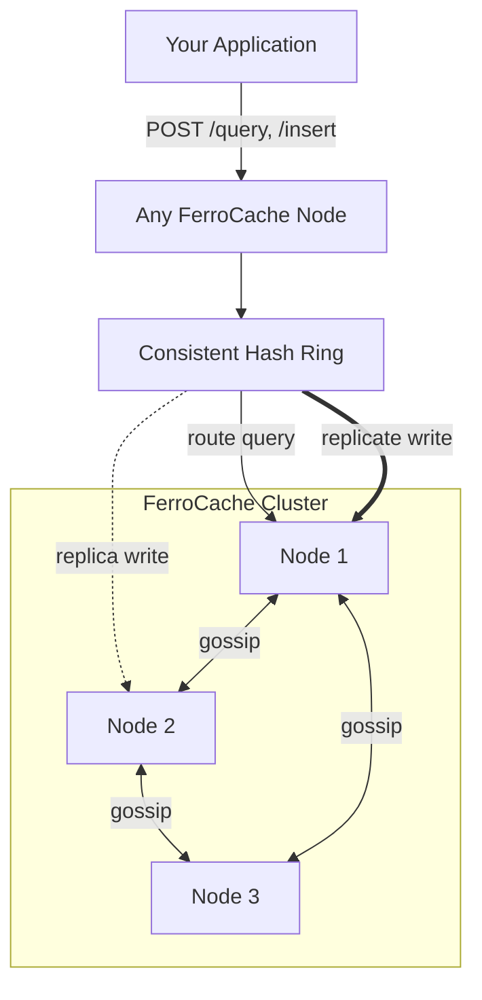

# FerroCache

**A Distributed Semantic Cache Service for LLM Applications**

FerroCache is a standalone service that sits in front of your LLM calls and returns cached responses for semantically similar queries. Because it's a compiled Rust binary with an HTTP API, **any language can use it** — Python, Go, Node.js, Java, Ruby, anything that can make an HTTP request. LLM API calls are expensive; semantically similar queries should reuse cached answers instead of paying for a new completion. Unlike GPTCache, FerroCache is a service, not an in-process library — deploy it once, share the cache across your entire fleet, and the cache survives application restarts.

[Documentation](#) · [PyPI](https://pypi.org/project/ferrocache) · [Docker](https://ghcr.io/nickleodoen/ferrocache) · [Changelog](#) · [Contributing](#)

---

## Features

**Cache core**
- [x] Semantic similarity search via HNSW (approximate nearest neighbor)
- [x] Exact-match pre-filter — verbatim queries return in <0.4ms
- [x] Configurable cosine similarity threshold (default: 0.92)
- [x] Embedding-model agnostic — bring your own vectors
- [x] Per-entry TTL with background expiry reaper
- [x] LRU eviction with configurable max entries per namespace
- [x] `DELETE /entry/:uuid` — targeted cache invalidation
- [x] `POST /admin/invalidate` — semantic radius invalidation

**Namespace isolation**
- [x] Model namespace partitioning — vectors from different models never compare
- [x] Tenant isolation via `cache_scope` — one cache, many tenants
- [x] Conversation scoping with two-level fallback (conversation → global)
- [x] Auto-TTL on conversation namespaces

**Durability & operations**
- [x] Write-ahead log (WAL) with fsync — survives process crashes
- [x] Atomic snapshots with WAL compaction
- [x] Group-commit WAL batching — 2,600+ inserts/sec at concurrency 50
- [x] Prometheus `/metrics` endpoint
- [x] Grafana dashboard (docker-compose overlay)
- [x] `/admin/entry-stats` — per-namespace access analytics

**Distribution**
- [x] Multi-node cluster via consistent hashing + chitchat gossip
- [x] Synchronous write replication (configurable replication factor)
- [x] Phi accrual failure detection (Cassandra-style)
- [x] Automatic ring reassignment on node failure (zero data movement)
- [x] Read repair — stale nodes heal through traffic

**Security**
- [x] Bearer token auth on HTTP API — opt-in via `FERROCACHE_AUTH_TOKEN`
- [x] Mutual TLS between cluster nodes — opt-in via `cluster.tls.enabled`
- [x] Constant-time token comparison (timing-attack safe)

**Integrations**
- [x] Python client (zero dependencies, stdlib only)
- [x] OpenAI SDK drop-in wrapper (`wrap_openai`)
- [x] Anthropic SDK drop-in wrapper (`wrap_anthropic`)
- [x] LangChain cache backend (`FerrocacheCache`)
- [x] LlamaIndex LLM wrapper (`FerrocacheLLM`)
- [x] MCP server for Claude Desktop / Claude Code
- [x] Any language via HTTP — Go, Node.js, Java, Ruby, etc.

---

## Quick Install

```bash
# Docker (recommended)
docker run -p 3000:3000 ghcr.io/nickleodoen/ferrocache:latest
```

```bash
# Python client
pip install ferrocache
pip install ferrocache[openai]    # + OpenAI middleware
pip install ferrocache[all]       # everything
```

```bash
# Build from source (Rust required)
git clone https://github.com/nickleodoen/ferrocache
cd ferrocache && cargo build --release
./target/release/ferrocache
```

<details>
<summary>▶ <strong>Example Usage</strong> (click to expand)</summary>

**Example 1 — Python (universal pattern, no framework):**

```python
from ferrocache import FerrocacheClient
import openai

client = FerrocacheClient("http://localhost:3000")
your_openai = openai.OpenAI()

def ask(question: str, embedding: list[float]) -> str:
    # Check cache first
    hit = client.query(embedding=embedding, threshold=0.92, model_id="gpt-4o-mini::1536")
    if hit["hit"]:
        return hit["response"]  # no LLM call needed

    # Cache miss — call the LLM
    answer = your_openai.chat.completions.create(
        model="gpt-4o-mini",
        messages=[{"role": "user", "content": question}],
    ).choices[0].message.content

    client.insert(
        embedding=embedding,
        response=answer,
        query_text=question,
        model_id="gpt-4o-mini::1536",
    )
    return answer
```

**Example 2 — Drop-in OpenAI wrapper (one line change):**

```python
from openai import OpenAI
from ferrocache.middleware import wrap_openai

client = wrap_openai(OpenAI())  # that's it

response = client.chat.completions.create(
    model="gpt-4o-mini",
    messages=[{"role": "user", "content": "What is the refund policy?"}],
)
print(response._ferrocache_hit)  # True on cache hit
```

**Example 3 — Tenant isolation (multi-tenant SaaS):**

```python
# Different tenants never share cache entries
client.insert(
    embedding=emb,
    response=answer,
    query_text="...",
    model_id="gpt-4o-mini::1536",
    cache_scope="tenant_abc",
)
result = client.query(embedding=emb, threshold=0.92, model_id="gpt-4o-mini::1536", cache_scope="tenant_abc")  # hits
result = client.query(embedding=emb, threshold=0.92, model_id="gpt-4o-mini::1536", cache_scope="tenant_xyz")  # miss
```

→ Full documentation with examples for all integrations: [docs.ferrocache.dev](#)

</details>

---

## Architecture



- Your app hits any node. Queries route to the correct shard via consistent hashing on the embedding vector. Writes replicate synchronously to N nodes.
- Nodes discover each other via gossip (chitchat). Ring membership updates propagate in ~2 seconds. No Zookeeper, no etcd, no coordinator.
- Node failures are detected by phi accrual (Cassandra-style). Failed nodes' ring arcs fold to their replica neighbor automatically.

---

## Benchmarks

**The right comparison for FerroCache is Redis, not GPTCache.**

GPTCache is a Python library — it runs inside your process and its "latency" is a function call, not a network call. FerroCache is a service — like Redis, it has a network boundary by design, which is what lets it be shared across your entire fleet.

**FerroCache performance** (Apple M4 Pro, release build):

| Operation | p50 | p95 | p99 |
|---|---|---|---|
| Query hit (HTTP round-trip) | 0.44ms | 0.51ms | 0.54ms |
| Query miss (HTTP round-trip) | 0.42ms | 0.48ms | 0.50ms |
| Insert (includes WAL fsync) | 7.95ms | 8.36ms | 8.71ms |
| Exact-match pre-filter | 0.38ms | — | — |

Insert throughput: **2,600+ ops/sec at concurrency 50** (group-commit WAL).

**Feature comparison vs GPTCache:**

| | FerroCache | GPTCache |
|---|---|---|
| Architecture | Service (HTTP) | Library (in-process) |
| Multi-node cluster | ✅ | ❌ |
| Shared across fleet | ✅ | ❌ (per-process) |
| WAL durability | ✅ (fsync) | ❌ (in-memory) |
| Survives app restart | ✅ | ❌ |
| Tenant isolation | ✅ `cache_scope` | ❌ |
| Conversation scoping | ✅ | ❌ |
| Exact-match pre-filter | ✅ | ❌ |
| TTL per entry | ✅ | ⚠️ partial |
| LRU eviction | ✅ | ✅ |
| Any language client | ✅ | ❌ (Python only) |
| Prometheus metrics | ✅ | ❌ |
| Memory (data path) | ~7 MB / 50 entries | ~7 MB / 50 entries |

> GPTCache query p50 is 0.082ms because it's an in-process function call. FerroCache query p50 is 0.44ms because it's an HTTP request — the same reason Redis is "slower" than a Python dict.

---

## Configuration

All keys default to single-node mode. Override via `ferrocache.toml` in the working directory or `FERROCACHE_*` env vars (env wins). Nested keys use `__` as a section separator; lists are comma-separated.

**Core**

| Key | Type | Default | Env var |
|---|---|---|---|
| `port` | u16 | `3000` | `FERROCACHE_PORT` |
| `node_id` | string? | random UUID | `FERROCACHE_NODE_ID` |
| `wal_path` | string | `./ferrocache.wal` | `FERROCACHE_WAL_PATH` |

**HNSW**

| Key | Type | Default | Env var |
|---|---|---|---|
| `hnsw.max_nb_connection` | usize | `16` | `FERROCACHE_HNSW__MAX_NB_CONNECTION` |
| `hnsw.ef_construction` | usize | `200` | `FERROCACHE_HNSW__EF_CONSTRUCTION` |
| `hnsw.ef_search` | usize | `32` | `FERROCACHE_HNSW__EF_SEARCH` |
| `hnsw.default_threshold` | f32 | `0.92` | `FERROCACHE_HNSW__DEFAULT_THRESHOLD` |
| `hnsw.max_entries_per_namespace` | usize? | `None` (unlimited) | `FERROCACHE_HNSW__MAX_ENTRIES_PER_NAMESPACE` |

**Eviction & TTL**

| Key | Type | Default | Env var |
|---|---|---|---|
| `expire_scan_interval_secs` | u64 | `60` | `FERROCACHE_EXPIRE_SCAN_INTERVAL_SECS` |
| `conversation_ttl_seconds` | u64? | `None` | `FERROCACHE_CONVERSATION_TTL_SECONDS` |

**Cluster**

| Key | Type | Default | Env var |
|---|---|---|---|
| `cluster.enabled` | bool | `false` | `FERROCACHE_CLUSTER__ENABLED` |
| `cluster.seed_nodes` | list<string> | `[]` | `FERROCACHE_CLUSTER__SEED_NODES` |
| `cluster.replication_factor` | usize | `2` | `FERROCACHE_CLUSTER__REPLICATION_FACTOR` |
| `cluster.read_repair_enabled` | bool | `true` | `FERROCACHE_CLUSTER__READ_REPAIR_ENABLED` |
| `cluster.dead_node_removal_enabled` | bool | `true` | `FERROCACHE_CLUSTER__DEAD_NODE_REMOVAL_ENABLED` |

**Security**

| Key | Type | Default | Env var |
|---|---|---|---|
| `auth_token` | string? | `None` (auth off) | `FERROCACHE_AUTH_TOKEN` |
| `cluster.tls.enabled` | bool | `false` | `FERROCACHE_CLUSTER__TLS__ENABLED` |

**Performance**

| Key | Type | Default | Env var |
|---|---|---|---|
| `wal_batch_size` | usize | `256` | `FERROCACHE_WAL_BATCH_SIZE` |
| `wal_batch_timeout_ms` | u64 | `1` | `FERROCACHE_WAL_BATCH_TIMEOUT_MS` |

Full reference at [docs.ferrocache.dev/getting-started/configuration](#).

---

## Production Cluster

Run a 3-node cluster when you need the cache to survive a node failure without any application-side changes.

```bash
docker compose up -d --build
sleep 5
./tests/cluster_integration.sh   # 44 assertions over the live cluster
docker compose down -v
```

External ports `3001`/`3002`/`3003` map to the three nodes. An insert sent to any node is replicated to `replication_factor` owners along the ring; a query sent to any node is forwarded to the owning shard.

---

## SDK Integrations

**OpenAI** — drop-in wrapper proxies attribute access; only the chat-completion method is intercepted.

```python
from openai import OpenAI
from ferrocache.middleware import wrap_openai

client = wrap_openai(OpenAI(), cache_scope="tenant_abc")
resp = client.chat.completions.create(
    model="gpt-4o-mini",
    messages=[{"role": "user", "content": "What is the capital of France?"}],
)
print(resp.choices[0].message.content, resp._ferrocache_hit)
```

→ [Full docs](#)

**Anthropic** — same pattern for the Anthropic SDK.

```python
from anthropic import Anthropic
from ferrocache.middleware import wrap_anthropic

client = wrap_anthropic(Anthropic())
resp = client.messages.create(
    model="claude-haiku-4-5",
    max_tokens=512,
    messages=[{"role": "user", "content": "Briefly: what is HNSW?"}],
)
```

→ [Full docs](#)

**LangChain** — register as the global LLM cache.

```python
from langchain.globals import set_llm_cache
from ferrocache.langchain import FerrocacheCache

set_llm_cache(FerrocacheCache(cache_scope="tenant_abc"))
```

→ [Full docs](#)

**LlamaIndex** — wrap any LlamaIndex-compatible LLM.

```python
from llama_index.llms.openai import OpenAI
from ferrocache.llamaindex import FerrocacheLLM

llm = FerrocacheLLM(inner=OpenAI(model="gpt-4o-mini"), cache_scope="tenant_abc")
```

→ [Full docs](#)

**MCP server** — exposes semantic caching as tools for Claude Desktop / Claude Code.

```bash
pip install -r clients/python/mcp_requirements.txt
python3 -m ferrocache.mcp_server      # speaks JSON-RPC over stdio
```

→ [Full docs](#)

---

## Contributing

FerroCache is actively developed and welcomes contributions. Three areas where contributions would have the most impact:

**1. Embedding model integrations**
FerroCache is embedding-agnostic by design — the client computes the vector. But most users want a default that just works. Adding first-class support for Voyage AI, Cohere, and local Ollama models to the Python client's auto-embed path would lower the barrier to adoption significantly.
Good first issue: add `ferrocache[voyage]` extra with a Voyage AI embed_fn.

**2. Async Python client**
The Python client and all middleware wrappers are synchronous. Modern Python LLM applications are async-native (LangChain LCEL, the async Anthropic client, FastAPI). An `AsyncFerrocacheClient` built on `httpx.AsyncClient` would unblock this entire class of users.
Good first issue: implement `AsyncFerrocacheClient` mirroring the sync client's API.

**3. Load testing and real-world benchmarks**
The current benchmarks run on synthetic FAQ workloads. Real-world hit rate data on production query distributions (MS MARCO, customer support logs, coding assistant queries) would help users calibrate their threshold and make the project more credible to evaluators.
Good first issue: publish a benchmark notebook using the MS MARCO dataset.

→ See [CONTRIBUTING.md](#) for setup instructions, code style, and the PR process.
→ Open issues are labeled [`good first issue`](https://github.com/nickleodoen/ferrocache/issues).

---

## Security

```bash
# Bearer token auth on the public HTTP API
export FERROCACHE_AUTH_TOKEN="$(openssl rand -hex 32)"

# Mutual TLS between cluster nodes
export FERROCACHE_CLUSTER__TLS__ENABLED=true
```

With auth on, `/health` and `/metrics` stay open; all data routes require `Authorization: Bearer <token>`. With mTLS on, FerroCache binds a second listener on `internal_port` (default `port + 1000`) requiring a client cert chained to the cluster CA. Public-port TLS is expected to be terminated by a reverse proxy. See [docs/security.md](docs/security.md) for the full threat model.

---

## Development

```bash
cargo test                        # unit tests (~222 pass)
cargo clippy --all-targets -- -D warnings
make cluster-test                 # docker compose + integration script (44 assertions)
make benchmark-vs-gptcache        # FerroCache vs GPTCache
```

CI runs `check`/`test`/`clippy`/`fmt` plus the docker-compose cluster integration on every push (`.github/workflows/ci.yml`).
