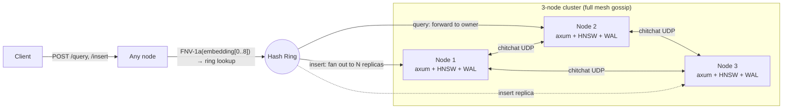

# ferrocache

A distributed semantic caching layer for LLM applications, written in Rust.

ferrocache stores `(embedding, response)` pairs and serves them by approximate-nearest-neighbour lookup, so a paraphrased prompt can hit a cached answer instead of paying for another model call. Unlike GPTCache, it's a single statically-linked binary with built-in clustering (consistent hashing + gossip + replication) and is embedding-model-agnostic — the client computes the embedding, ferrocache stores the float vector.

## Features
- Sub-200µs query latency on a 1k-entry index (HNSW, 384-dim vectors)
- Multi-node clustering with consistent hashing and chitchat gossip discovery
- Synchronous write replication with a configurable replication factor
- WAL-based durability — entries survive restarts (NDJSON, fsync per insert)
- Embedding-model-agnostic — works with OpenAI, Anthropic, local models, anything that emits float vectors
- Single statically-linked binary, deployable as a sidecar
- Configurable via TOML or environment variables (env wins)

## Quickstart

### Run the cache server

```bash
docker run -p 3000:3000 ghcr.io/nickleodoen/ferrocache:latest
```

Or build from source:

```bash
git clone https://github.com/nickleodoen/ferrocache && cd ferrocache
cargo build --release
./target/release/ferrocache
```

### Use it

```bash
# Insert
curl -s -X POST http://localhost:3000/insert \
  -H 'Content-Type: application/json' \
  -d '{"embedding":[1.0,0.0,0.0,0.0],"response":"42","query_text":"meaning of life"}'

# Query
curl -s -X POST http://localhost:3000/query \
  -H 'Content-Type: application/json' \
  -d '{"embedding":[1.0,0.0,0.0,0.0],"threshold":0.9}'
# {"hit":true,"id":"...","response":"42","similarity":1.0}
```

### Install the Python client

```bash
pip install ferrocache              # zero deps
pip install ferrocache[openai]      # + OpenAI middleware
pip install ferrocache[all]         # everything (langchain, llamaindex, mcp, ...)
```

### 3-node cluster

```bash
docker compose up -d --build
sleep 5
./tests/cluster_integration.sh   # 18 assertions over the live cluster
docker compose down -v
```

External ports `3001`/`3002`/`3003` map to the three nodes. An insert sent to any node is replicated to `replication_factor` owners along the ring; a query sent to any node is forwarded to the owning shard.

## Installation

| Method                | Command                                                      | What you get                       |
|-----------------------|--------------------------------------------------------------|------------------------------------|
| Docker                | `docker run -p 3000:3000 ghcr.io/nickleodoen/ferrocache`     | Rust cache server                  |
| Cargo                 | `cargo build --release`                                      | Build from source                  |
| pip (base)            | `pip install ferrocache`                                     | Python client (zero deps)          |
| pip + OpenAI          | `pip install ferrocache[openai]`                             | + OpenAI middleware                |
| pip + Anthropic       | `pip install ferrocache[anthropic]`                          | + Anthropic middleware             |
| pip + LangChain       | `pip install ferrocache[langchain]`                          | + LangChain cache backend          |
| pip + LlamaIndex      | `pip install ferrocache[llamaindex]`                         | + LlamaIndex wrapper               |
| pip + MCP             | `pip install ferrocache[mcp]`                                | + Claude Desktop / Code MCP server |
| pip + all             | `pip install ferrocache[all]`                                | Everything                         |

## API

| Method | Path              | Description                                         |
|--------|-------------------|-----------------------------------------------------|
| POST   | `/insert`         | Insert `(embedding, response, query_text)`. Returns `{id, status}`. |
| POST   | `/query`          | Lookup nearest neighbour. Returns `{hit, id?, response?, similarity?}`. |
| GET    | `/health`         | `{status, node_id, entry_count}`                    |
| GET    | `/stats`          | `{entry_count, wal_path, hnsw{...,dimension}}`      |
| GET    | `/cluster/status` | `{mode, self_node_id, nodes, node_count, gossip_addr?}` |

`POST /insert` and `POST /query` accept `?local=true` to skip ring routing — used by forwarded requests internally and useful for diagnostics.

### Insert

```json
POST /insert
{ "embedding": [0.1, 0.2, ...], "response": "the cached answer", "query_text": "the prompt" }
→ 200 { "id": "<uuid>", "status": "ok" }
```

### Query

```json
POST /query
{ "embedding": [0.1, 0.2, ...], "threshold": 0.92 }
→ 200 { "hit": true, "id": "<uuid>", "response": "...", "similarity": 0.97 }
→ 200 { "hit": false }
```

Errors return `400` for bad input, `502` when a peer is unreachable, `500` for local failures.

## Configuration

All keys default to single-node mode. Override via `ferrocache.toml` in the working directory or `FERROCACHE_*` env vars (env wins). Nested keys use `__` as a section separator; lists are comma-separated.

| Key                           | Type         | Default              | Env var                                |
|-------------------------------|--------------|----------------------|----------------------------------------|
| `port`                        | u16          | `3000`               | `FERROCACHE_PORT`                      |
| `node_id`                     | string?      | random UUID          | `FERROCACHE_NODE_ID`                   |
| `wal_path`                    | string       | `./ferrocache.wal`   | `FERROCACHE_WAL_PATH`                  |
| `hnsw.max_nb_connection`      | usize        | `16`                 | `FERROCACHE_HNSW__MAX_NB_CONNECTION`   |
| `hnsw.max_elements`           | usize        | `100000`             | `FERROCACHE_HNSW__MAX_ELEMENTS`        |
| `hnsw.ef_construction`        | usize        | `200`                | `FERROCACHE_HNSW__EF_CONSTRUCTION`     |
| `hnsw.ef_search`              | usize        | `32`                 | `FERROCACHE_HNSW__EF_SEARCH`           |
| `hnsw.default_threshold`      | f32          | `0.92`               | `FERROCACHE_HNSW__DEFAULT_THRESHOLD`   |
| `cluster.enabled`             | bool         | `false`              | `FERROCACHE_CLUSTER__ENABLED`          |
| `cluster.gossip_addr`         | string       | `0.0.0.0:4000`       | `FERROCACHE_CLUSTER__GOSSIP_ADDR`      |
| `cluster.api_addr`            | string       | `0.0.0.0:3000`       | `FERROCACHE_CLUSTER__API_ADDR`         |
| `cluster.seed_nodes`          | list<string> | `[]`                 | `FERROCACHE_CLUSTER__SEED_NODES` (CSV) |
| `cluster.virtual_nodes`       | usize        | `64`                 | `FERROCACHE_CLUSTER__VIRTUAL_NODES`    |
| `cluster.replication_factor`  | usize        | `2`                  | `FERROCACHE_CLUSTER__REPLICATION_FACTOR` |

## Architecture



**Request flow.** A client hits any node. `/query` is forwarded to whichever node owns `FNV-1a(embedding[0..8])` on the ring. `/insert` walks the ring clockwise from that position, picks `replication_factor` distinct physical nodes, and replicates synchronously — the coordinator stamps the UUID, writes to its own WAL+index if it's a replica, then forwards to each remaining replica with `?local=true` (loop prevention). Any replica failure → `502`.

**Data plane.** Each node owns an in-memory `Hnsw<f32, DistCosine>` index plus a `HashMap<usize, CacheEntry>` side-table keyed by the HNSW internal id. The UUID lives inside the entry. WAL is newline-delimited JSON, fsync per insert; on startup, the WAL is replayed before the listener binds, so durable entries reuse their persisted UUIDs.

**Control plane.** Cluster membership is gossiped via [chitchat](https://github.com/quickwit-oss/chitchat) (Quickwit's Scuttlebutt impl). Each node advertises its API address as a chitchat KV under `api_addr`. A 2-second background reconciler diffs `chitchat.live_nodes()` against the local ring, applies adds/removes, and refreshes the `node_id → api_addr` map.

## Design decisions

- **Why not a vector DB.** ferrocache is a *cache*, not a search system. Single-purpose, single binary, no schema, no indexes-per-collection — it sits next to your app like Redis.
- **Why consistent hashing.** Adding/removing a node only remaps `1/N` of keys instead of every key. FNV-1a (not SipHash) so node positions are identical across processes — required for ring agreement without a coordinator.
- **Why synchronous replication.** Cache writes are infrequent vs reads; durability simplicity > write throughput for this workload. Async replication would need anti-entropy and read-repair, which is a different project.
- **Why Rust.** A cache in front of an LLM lives on the latency hot path. We want predictable tail latencies (no GC pauses) and a single static binary that drops onto any host.
- **Why HNSW over IVF/PQ.** HNSW gives sub-millisecond recall at our scale (≤100k entries per node) without index training. IVF/PQ make sense above ~10M vectors, not here.

## Benchmarks

Measured on Apple Silicon via `cargo bench`. Numbers are wall-clock per operation, 384-dim unit vectors, 1k pre-populated entries where applicable.

| Benchmark               | Latency (median) | Notes                                  |
|-------------------------|------------------|----------------------------------------|
| Index insert (384-dim)  | 21.6 µs          | Fresh index per iter, in-memory only   |
| Query hit (1k entries)  | 152 µs           | HNSW ANN + side-table lookup           |
| Query miss (1k entries) | 154 µs           | Same path, threshold rejects neighbour |
| Insert + WAL fsync      | 5.1 ms           | fsync-per-insert dominates (APFS)      |

Reproduce with `cargo bench`. HTML reports land in `target/criterion/`.

## Simulation

`tests/simulate.py` runs a realistic FAQ workload — 15 seed questions, 3 semantic variations each, plus 10 unrelated queries — against a live ferrocache. Embeddings are computed locally with `all-MiniLM-L6-v2`; no API keys.

```bash
cargo run --release      # in another terminal
make simulate            # pip-installs sentence-transformers + runs the script
```

Sample output (Apple Silicon, single node, threshold 0.90):

```
Cache Performance
  Hit rate:           100.0% (45/45 expected-hit queries matched)
  False misses:       0 (variations too different at threshold 0.9)
  True misses:        10/10 (unrelated queries correctly missed)

Latency (ferrocache only, excludes embedding time)
  Insert:             p50=5.0ms  p99=11.5ms   mean=5.6ms
  Query (hit):        p50=0.9ms  p99=1.2ms   mean=0.9ms
  Query (miss):       p50=1.0ms  p99=3.2ms   mean=1.3ms
```

The hit rate depends on `--threshold`; lowering it surfaces more variations as hits at the cost of false positives. Latency numbers exclude embedding time so you can see ferrocache round-trip vs the model. Drop the `--url` flag at `localhost:3001` to point at the Docker cluster (`make simulate-cluster`).

For machines without PyTorch, `make simulate-no-ml` runs the same shape of workload with random unit vectors — hit rate is meaningless but latency is accurate. Zero external Python deps.

## Python client

A zero-dependency stdlib-only client lives in `clients/python/`.

```python
from ferrocache import FerrocacheClient

client = FerrocacheClient("http://localhost:3000")
client.insert(embedding=[1.0, 0.0, 0.0, 0.0], response="42", query_text="meaning")
hit = client.query(embedding=[1.0, 0.0, 0.0, 0.0], threshold=0.9)
print(hit["hit"], hit.get("response"))
```

Run the demo: `python3 clients/python/example_usage.py` (after starting a node).

## SDK Middleware

Add semantic caching to an existing OpenAI or Anthropic script with one line. The wrapper proxies attribute access — only the chat-completion / message-creation method is intercepted; everything else passes through.

### OpenAI

```python
from openai import OpenAI
from ferrocache.middleware import wrap_openai

client = wrap_openai(OpenAI())  # default: localhost:3000, threshold 0.92

resp = client.chat.completions.create(
    model="gpt-4o-mini",
    messages=[{"role": "user", "content": "What is the capital of France?"}],
)
print(resp.choices[0].message.content, resp._ferrocache_hit)
```

### Anthropic

```python
from anthropic import Anthropic
from ferrocache.middleware import wrap_anthropic

client = wrap_anthropic(Anthropic())

resp = client.messages.create(
    model="claude-haiku-4-5",
    max_tokens=512,
    messages=[{"role": "user", "content": "Briefly: what is HNSW?"}],
)
print(resp.content[0].text, resp._ferrocache_hit)
```

### Configuration

| Argument     | Default                       | Env var                  |
|--------------|-------------------------------|--------------------------|
| `cache_url`  | `http://localhost:3000`       | `FERROCACHE_URL`         |
| `threshold`  | `0.92`                        | `FERROCACHE_THRESHOLD`   |
| `embed_fn`   | `sentence-transformers` (`all-MiniLM-L6-v2`) | —         |
| `fail_open`  | `True` — cache outage falls through to the real API | — |

Pass your own `embed_fn` (any `str -> list[float]`) to skip the sentence-transformers dependency. Cached responses include `_ferrocache_hit=True` and `_ferrocache_similarity=<score>`; misses set `_ferrocache_hit=False`; fail-open sets it to `None`.

## Framework Integration

### LangChain

`FerrocacheCache` implements `langchain_core.caches.BaseCache`, so you enable it globally with one line:

```python
from langchain.globals import set_llm_cache
from ferrocache.langchain import FerrocacheCache

set_llm_cache(FerrocacheCache())
```

Every LLM call in your chain now consults ferrocache first. `clear()` is a no-op (ferrocache is append-only — drop the WAL to reset).

### LlamaIndex

`FerrocacheLLM` subclasses `CustomLLM`, so it can stand in anywhere a LlamaIndex LLM is expected — query engines, agents, retrievers — and consults ferrocache before delegating to the wrapped LLM:

```python
from llama_index.llms.openai import OpenAI
from ferrocache.llamaindex import FerrocacheLLM

llm = FerrocacheLLM(inner=OpenAI(model="gpt-4o-mini"))
```

Both backends accept `embed_fn`, `cache_url`, `threshold`, and `fail_open` kwargs (same semantics as the SDK middleware). Optional deps: `langchain-core` for the LangChain backend, `llama-index-core` for the LlamaIndex one — neither is auto-imported, so users who don't use a framework never need to install it.

See `clients/python/example_langchain.py` and `example_llamaindex.py` for runnable demos.

## MCP Server (Claude Desktop / Claude Code)

ferrocache ships an MCP server that exposes semantic caching as tools for any MCP-capable agent. Tools accept text — the MCP layer embeds locally before talking to ferrocache.

```bash
pip install -r clients/python/mcp_requirements.txt
python3 -m ferrocache.mcp_server      # speaks JSON-RPC over stdio
```

| Tool                     | What it does                                              |
|--------------------------|-----------------------------------------------------------|
| `semantic_cache_lookup`  | Search for a cached response by query text                |
| `semantic_cache_store`   | Store a query-response pair                               |
| `cache_status`           | Server health + entry count                               |

Full setup (Claude Desktop / Claude Code config snippets, env vars, troubleshooting): see [`docs/mcp-setup.md`](docs/mcp-setup.md).

## Development

```bash
cargo test                        # unit tests (40)
cargo clippy --all-targets -- -D warnings
cargo fmt --check
cargo bench                       # criterion benchmarks
make cluster-test                 # docker compose + integration script
```

CI runs `check`/`test`/`clippy`/`fmt` plus the docker-compose cluster integration on every push (`.github/workflows/ci.yml`).
