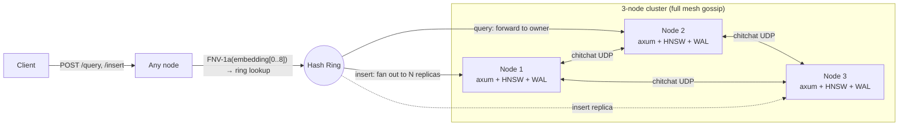

# ferrocache

A distributed semantic cache for LLM applications, written in Rust.

ferrocache stores `(embedding, response)` pairs and serves them by approximate-nearest-neighbour lookup, so a paraphrased prompt can hit a cached answer instead of paying for another model call. Unlike GPTCache, it's a single statically-linked binary with built-in clustering (consistent hashing + gossip + replication) and is embedding-model-agnostic — the client computes the embedding, ferrocache stores the float vector.

**v1.0** — production-ready: durable WAL with group-commit, multi-node clustering with phi-accrual failure detection and read repair, LRU eviction, TTL expiry, targeted deletion, semantic invalidation, exact-match pre-filter, multi-tenant isolation, and conversation-scoped caching.

## Features

**Core**
- Sub-millisecond query latency on a 1k-entry index (HNSW, 384-dim vectors)
- Embedding-model-agnostic — works with OpenAI, Anthropic, sentence-transformers, anything that emits float vectors
- Single statically-linked binary
- WAL durability with **group-commit** — entries survive restarts; one fsync per batch instead of per insert (~7.5× insert throughput at concurrency 100)
- Snapshot + WAL compaction — bounded WAL replay on startup

**Cluster**
- Consistent hashing ring + chitchat gossip discovery
- Synchronous replication, configurable replication factor
- Replication retry with exponential backoff + jitter
- Phi-accrual failure detector with `Alive → Suspected → Dead` state machine
- Automatic ring reassignment on Dead; zero data movement (replication_factor ≥ 2)
- Read repair — on a coordinator miss, parallel-query non-dead replicas; durable backfill via WAL

**Cache lifecycle (v1.0)**
- **LRU eviction** — `max_entries_per_namespace` cap; lazy HNSW deletion + periodic rebuild
- **TTL expiry** — per-entry `ttl_seconds`; background reaper writes tombstones
- **Targeted deletion** — `DELETE /entry/:uuid`; cluster fan-out to all live peers
- **Semantic invalidation** — `POST /admin/invalidate`; radius-delete by embedding similarity
- **Exact-match pre-filter** — O(1) HashMap lookup before HNSW for verbatim repeat queries
- **Per-entry access tracking** — `inserted_at`, `last_accessed_at`, `access_count`; surfaces top-N via `/admin/entry-stats`

**Tenancy & context (v1.0)**
- **`cache_scope`** — composite namespace key (`{model_id}::{scope}`) for tenant / user / system-prompt isolation
- **`conversation_id`** — two-level lookup: conversation namespace first, base namespace fallback; auto-TTL via `conversation_ttl_seconds`; empty conversation namespaces auto-pruned

**Security**
- Bearer-token auth (constant-time compare)
- Cluster mTLS (rcgen + rustls; second listener on `internal_port`)

**Observability**
- Prometheus `/metrics` (hand-written, no `prometheus` crate)
- 8-panel Grafana dashboard via the monitoring overlay
- Per-namespace counters: `queries`, `hits`, `misses`, `evictions`, `expirations`, `deletions`, `invalidations`, `exact_match_hits`

## Quickstart

### Run the cache server

```bash
docker run -p 3000:3000 ghcr.io/nickleodoen/ferrocache:latest
```

Or build from source:

```bash
git clone https://github.com/nickleodoen/ferrocache && cd ferrocache
cargo build --release
./target/release/ferrocache
```

### Use it

```bash
# Insert
curl -s -X POST http://localhost:3000/insert \
  -H 'Content-Type: application/json' \
  -d '{"embedding":[1.0,0.0,0.0,0.0],"response":"42","query_text":"meaning of life","model_id":"my-model::4"}'

# Query
curl -s -X POST http://localhost:3000/query \
  -H 'Content-Type: application/json' \
  -d '{"embedding":[1.0,0.0,0.0,0.0],"threshold":0.9,"model_id":"my-model::4"}'
# {"hit":true,"id":"...","response":"42","similarity":1.0,"exact_match":false}
```

### Install the Python client

```bash
pip install ferrocache              # zero deps
pip install ferrocache[openai]      # + OpenAI middleware
pip install ferrocache[all]         # everything (langchain, llamaindex, mcp, ...)
```

### 3-node cluster

```bash
docker compose up -d --build
sleep 5
./tests/cluster_integration.sh   # 44 assertions over the live cluster (32 baseline + 12 Phase 7)
docker compose down -v
```

External ports `3001`/`3002`/`3003` map to the three nodes. An insert sent to any node is replicated to `replication_factor` owners along the ring; a query sent to any node is forwarded to the owning shard.

## Installation

| Method                | Command                                                      | What you get                       |
|-----------------------|--------------------------------------------------------------|------------------------------------|
| Docker                | `docker run -p 3000:3000 ghcr.io/nickleodoen/ferrocache`     | Rust cache server                  |
| Cargo                 | `cargo build --release`                                      | Build from source                  |
| pip (base)            | `pip install ferrocache`                                     | Python client (zero deps)          |
| pip + OpenAI          | `pip install ferrocache[openai]`                             | + OpenAI middleware                |
| pip + Anthropic       | `pip install ferrocache[anthropic]`                          | + Anthropic middleware             |
| pip + LangChain       | `pip install ferrocache[langchain]`                          | + LangChain cache backend          |
| pip + LlamaIndex      | `pip install ferrocache[llamaindex]`                         | + LlamaIndex wrapper               |
| pip + MCP             | `pip install ferrocache[mcp]`                                | + Claude Desktop / Code MCP server |
| pip + all             | `pip install ferrocache[all]`                                | Everything                         |

## API

| Method | Path                  | Description                                                                                       |
|--------|-----------------------|---------------------------------------------------------------------------------------------------|
| POST   | `/insert`             | Insert `(embedding, response, query_text, model_id)`. Optional: `ttl_seconds`, `cache_scope`, `conversation_id`. |
| POST   | `/query`              | Lookup. Required: `embedding, threshold, model_id`. Optional: `query_text` (exact-match pre-filter), `cache_scope`, `conversation_id`. |
| DELETE | `/entry/:uuid`        | Delete a specific entry; cluster fan-out to all live peers (404 = idempotent).                    |
| GET    | `/health`             | `{status, node_id, entry_count}`                                                                  |
| GET    | `/stats`              | Entry counts, per-namespace breakdown (incl. access stats), top-level counters.                   |
| GET    | `/metrics`            | Prometheus text exposition (hand-written, no extra crate).                                        |
| GET    | `/cluster/status`     | Cluster membership, peer phi values, dead-node list, `read_repair_enabled`.                       |
| POST   | `/admin/compact`      | Trigger WAL compaction + snapshot now.                                                            |
| POST   | `/admin/invalidate`   | Radius-delete entries with cosine similarity ≥ threshold.                                         |
| GET    | `/admin/entry-stats`  | Top-10 most-accessed entries per namespace.                                                       |

`POST /insert`, `POST /query`, and `POST /admin/invalidate` accept `?local=true` to skip ring routing — used by forwarded requests internally and for diagnostics.

### Insert

```json
POST /insert
{
  "embedding": [0.1, 0.2, ...],
  "response": "the cached answer",
  "query_text": "the prompt",
  "model_id": "all-MiniLM-L6-v2::384",
  "ttl_seconds": 3600,            // optional (M26)
  "cache_scope": "tenant_abc",    // optional (M28)
  "conversation_id": "conv_xyz"   // optional (M29)
}
→ 200 { "id": "<uuid>", "status": "ok" }
```

### Query

```json
POST /query
{
  "embedding": [0.1, 0.2, ...],
  "threshold": 0.92,
  "model_id": "all-MiniLM-L6-v2::384",
  "query_text": "the prompt",       // optional — enables M27 exact-match pre-filter
  "cache_scope": "tenant_abc",      // optional (M28)
  "conversation_id": "conv_xyz"     // optional (M29) — triggers two-level lookup
}
→ 200 { "hit": true, "id": "<uuid>", "response": "...", "similarity": 0.97,
         "exact_match": false,        // true when M27 pre-filter fired
         "scope": "conversation"      // "conversation" | "global" — M29 only
       }
→ 200 { "hit": false }
```

Errors return `400` for bad input, `502` when a peer is unreachable, `500` for local failures.

## Configuration

All keys default to single-node mode. Override via `ferrocache.toml` in the working directory or `FERROCACHE_*` env vars (env wins). Nested keys use `__` as a section separator; lists are comma-separated.

| Key                                  | Type         | Default              | Env var                                        |
|--------------------------------------|--------------|----------------------|------------------------------------------------|
| `port`                               | u16          | `3000`               | `FERROCACHE_PORT`                              |
| `node_id`                            | string?      | random UUID          | `FERROCACHE_NODE_ID`                           |
| `wal_path`                           | string       | `./ferrocache.wal`   | `FERROCACHE_WAL_PATH`                          |
| `auth_token`                         | string?      | `None` (auth off)    | `FERROCACHE_AUTH_TOKEN`                        |
| `wal_batch_size`                     | usize        | `256`                | `FERROCACHE_WAL_BATCH_SIZE`                    |
| `wal_batch_timeout_ms`               | u64          | `1`                  | `FERROCACHE_WAL_BATCH_TIMEOUT_MS`              |
| `compact_interval_inserts`           | u64          | `10000`              | `FERROCACHE_COMPACT_INTERVAL_INSERTS`          |
| `expire_scan_interval_secs`          | u64          | `60`                 | `FERROCACHE_EXPIRE_SCAN_INTERVAL_SECS`         |
| `conversation_ttl_seconds`           | u64?         | `None` (no auto-TTL) | `FERROCACHE_CONVERSATION_TTL_SECONDS`          |
| `hnsw.max_nb_connection`             | usize        | `16`                 | `FERROCACHE_HNSW__MAX_NB_CONNECTION`           |
| `hnsw.max_elements`                  | usize        | `100000`             | `FERROCACHE_HNSW__MAX_ELEMENTS`                |
| `hnsw.ef_construction`               | usize        | `200`                | `FERROCACHE_HNSW__EF_CONSTRUCTION`             |
| `hnsw.ef_search`                     | usize        | `32`                 | `FERROCACHE_HNSW__EF_SEARCH`                   |
| `hnsw.default_threshold`             | f32          | `0.92`               | `FERROCACHE_HNSW__DEFAULT_THRESHOLD`           |
| `hnsw.max_entries_per_namespace`     | usize?       | `None` (unlimited)   | `FERROCACHE_HNSW__MAX_ENTRIES_PER_NAMESPACE`   |
| `cluster.enabled`                    | bool         | `false`              | `FERROCACHE_CLUSTER__ENABLED`                  |
| `cluster.gossip_addr`                | string       | `0.0.0.0:4000`       | `FERROCACHE_CLUSTER__GOSSIP_ADDR`              |
| `cluster.api_addr`                   | string       | `0.0.0.0:3000`       | `FERROCACHE_CLUSTER__API_ADDR`                 |
| `cluster.seed_nodes`                 | list<string> | `[]`                 | `FERROCACHE_CLUSTER__SEED_NODES` (CSV)         |
| `cluster.virtual_nodes`              | usize        | `64`                 | `FERROCACHE_CLUSTER__VIRTUAL_NODES`            |
| `cluster.replication_factor`         | usize        | `2`                  | `FERROCACHE_CLUSTER__REPLICATION_FACTOR`       |
| `cluster.max_replication_retries`    | usize        | `3`                  | `FERROCACHE_CLUSTER__MAX_REPLICATION_RETRIES`  |
| `cluster.phi_threshold`              | f64          | `8.0`                | `FERROCACHE_CLUSTER__PHI_THRESHOLD`            |
| `cluster.dead_node_removal_enabled`  | bool         | `true`               | `FERROCACHE_CLUSTER__DEAD_NODE_REMOVAL_ENABLED`|
| `cluster.read_repair_enabled`        | bool         | `true`               | `FERROCACHE_CLUSTER__READ_REPAIR_ENABLED`      |
| `cluster.tls.enabled`                | bool         | `false`              | `FERROCACHE_CLUSTER__TLS__ENABLED`             |

## Eviction and Expiry

Entries can leave the cache through four distinct paths. All of them write durable WAL tombstones, so a restarted node never re-materialises a removed entry.

| Path                                | Trigger                                                                  |
|-------------------------------------|--------------------------------------------------------------------------|
| **LRU eviction (capacity)**         | Set `max_entries_per_namespace`. The flush task evicts the least-recently-accessed entries after each insert batch until the namespace fits the cap. Tie-break is `(last_accessed_at, inserted_at, internal_id)` for deterministic FIFO-on-tie. |
| **TTL expiry (age)**                | Set `ttl_seconds` on insert (or `conversation_ttl_seconds` server-wide for conversation entries). The query path checks `expires_at` inline (no state mutation); a background reaper runs every `expire_scan_interval_secs`, sweeps expired entries, writes tombstones, then `rebuild_dirty_namespaces` and prunes empty conversation namespaces. |
| **Explicit deletion (UUID)**        | `DELETE /entry/:uuid`. Cluster fan-out to all live peers (404 = idempotent). The reverse `uuid → namespace` map handles namespace resolution server-side. |
| **Semantic invalidation (radius)**  | `POST /admin/invalidate {embedding, threshold, model_id, [cache_scope]}`. O(n) cosine-similarity sweep; each replica computes its own match set against the same `(embedding, threshold)` — no UUID list shipped. |

HNSW has no deletion API, so removed entries become **ghosts** in the graph until rebuild. The query path filters ghost ids before applying the threshold; the namespace rebuilds when the ghost ratio crosses 20%. Conversation namespaces whose entries and ghost set are both empty are auto-pruned by the reaper.

Observability: `ferrocache_evictions_total`, `ferrocache_expirations_total`, `ferrocache_deletions_total`, `ferrocache_invalidations_total`, `ferrocache_index_rebuilds_total` (all top-level + per-namespace).

## Tenant Isolation

`cache_scope` composes with `model_id` to produce a tenant-isolated namespace. Every cache operation is scoped to that namespace; cross-tenant reads are impossible by construction.

```python
from openai import OpenAI
from ferrocache.middleware import wrap_openai

# Each tenant gets an isolated cache namespace.
client_a = wrap_openai(OpenAI(), cache_scope="tenant_abc")
client_b = wrap_openai(OpenAI(), cache_scope="tenant_xyz")

# Same question, different tenants — no cross-contamination.
resp_a = client_a.chat.completions.create(model="gpt-4o-mini", messages=[
    {"role": "user", "content": "Summarize last quarter's report."}
])
resp_b = client_b.chat.completions.create(model="gpt-4o-mini", messages=[
    {"role": "user", "content": "Summarize last quarter's report."}
])
# resp_a.choices[0].message.content != resp_b.choices[0].message.content
```

Common scope values: tenant ID, user ID, model temperature, system prompt version, or any composition (`f"{tenant}:{temp}"`). ferrocache treats `cache_scope` as an opaque string — the caller decides what isolation matters.

`max_entries_per_namespace` applies **per scoped namespace** — a noisy tenant can't evict a quiet tenant's entries. Resource isolation comes for free with the namespace partitioning.

`/stats` shows scoped namespaces as first-class entries:

```json
{
  "namespaces": {
    "all-MiniLM-L6-v2::384":              { "entry_count": 500 },
    "all-MiniLM-L6-v2::384::tenant_abc":  { "entry_count": 200 },
    "all-MiniLM-L6-v2::384::tenant_xyz":  { "entry_count": 150 }
  }
}
```

## Multi-Turn Conversations

`conversation_id` adds a third namespace segment for context-dependent answers. Inserts with `conversation_id` go to the conversation namespace **only**. Queries with `conversation_id` do a **two-level lookup** — conversation namespace first, base namespace as fallback.

```python
client.insert(
    embedding=embed("We decided on Option B."),
    response="Per our discussion, Option B was selected.",
    query_text="we decided on Option B",
    model_id="...",
    conversation_id="conv_2026_05_01",   # context-dependent — goes to conv ns
)

client.insert(
    embedding=embed("What is HNSW?"),
    response="Hierarchical Navigable Small World — an ANN graph index.",
    query_text="What is HNSW?",
    model_id="...",
    # No conversation_id — generic factual answer; goes to base namespace
)

# Query within the conversation:
hit = client.query(
    embedding=embed("what did we decide?"),
    threshold=0.85,
    model_id="...",
    conversation_id="conv_2026_05_01",
)
# hit["scope"] == "conversation" — context-specific answer

hit = client.query(
    embedding=embed("HNSW algorithm"),
    threshold=0.85,
    model_id="...",
    conversation_id="conv_2026_05_01",
)
# hit["scope"] == "global" — fell back to base ns; factual answer is shared
```

Two-level lookup priority order: **conversation > global**. A query without `conversation_id` never sees conversation-namespace entries. Set `FERROCACHE_CONVERSATION_TTL_SECONDS` to bound conversation entry lifetime; the reaper auto-prunes the namespace once its entries expire.

## Benchmarks

### Single-operation latency (criterion)

Measured on Apple Silicon via `cargo bench`. 384-dim unit vectors, 1k pre-populated entries where applicable.

| Benchmark               | Latency (median) | Notes                                  |
|-------------------------|------------------|----------------------------------------|
| Index insert (384-dim)  | 21.6 µs          | Fresh index per iter, in-memory only   |
| Query hit (1k entries)  | 152 µs           | HNSW ANN + side-table lookup           |
| Query miss (1k entries) | 154 µs           | Same path, threshold rejects neighbour |
| Insert + WAL fsync      | 5.1 ms           | fsync-per-insert dominates (APFS)      |

### Throughput under concurrency

Measured on Apple Silicon, `cargo run --release`, 384-dim embeddings, 5s per cell. Reproduce with `make bench-concurrent`.

The pre-M20 path took the WAL mutex per insert → `fsync(2)` serialized every writer. Group-commit coalesces concurrent inserts into a single batched write + one fsync.

**Insert throughput** (per-insert fsync vs default group-commit, 384-dim embeddings):

| Mode                | 1 client | 10 clients | 50 clients | 100 clients |
|---------------------|---------:|-----------:|-----------:|------------:|
| Per-insert fsync    |  169/s   |   183/s    |   167/s    |    183/s    |
| Group-commit (256)  |  122/s   |   682/s    |  1057/s    |   1900/s    |
| **Speedup**         |   0.7×   |    3.7×    |    6.3×    |    10.4×    |

p99 insert latency at concurrency 100: **675ms (no group-commit) → 70ms (group-commit)**.

**Query throughput** (read path — no fsync):

| Workload      | 1 client | 10 clients | 50 clients | 100 clients |
|---------------|---------:|-----------:|-----------:|------------:|
| Query (hit)   | 1568/s   |  3529/s    |  3513/s    |   3491/s    |
| Query (miss)  | 2632/s   |  3498/s    |  3513/s    |   3579/s    |

**Eviction overhead** (concurrency 100, 5K entry cap forcing rebuild on every batch):

| Setting                              | Insert ops/s | p99 insert |
|--------------------------------------|-------------:|-----------:|
| `max_entries_per_namespace=None`     |   1900/s     |     70ms   |
| `max_entries_per_namespace=5000`     |   1313/s     |   1824ms   |

LRU eviction adds ~30% throughput overhead under sustained pressure. The p99 spike comes from periodic HNSW rebuilds (20% ghost-ratio threshold) running under the index write lock — a known trade-off of inline rebuild for graph quality.

### vs GPTCache

Same workload (200 inserts, 600 expected-hit queries, 50 unrelated; 384-dim embeddings via sentence-transformers `all-MiniLM-L6-v2`; threshold 0.90; Apple Silicon). Reproduce with `make benchmark-vs-gptcache`.

| Metric                            | ferrocache | GPTCache | Notes                                  |
|-----------------------------------|------------|----------|----------------------------------------|
| Hit rate (threshold 0.90)         | 99.8%      | N/A †    | Same embedding model                   |
| False hits on unrelated           | 0          | N/A †    |                                        |
| Query latency p50                 | 0.44ms     | N/A †    | ferrocache: HTTP round-trip             |
| Query latency p99                 | 0.84ms     | N/A †    |                                        |
| Insert latency p50                | 8.05ms     | N/A †    | ferrocache: WAL fsync                  |
| Insert latency p99                | 10.88ms    | N/A †    |                                        |
| RSS after 200-entry seed          | 14.1 MB    | N/A †    | resident set size                      |
| Insert throughput (concurrency 50)| 2476/s     | N/A      | GPTCache is single-threaded            |

† GPTCache requires `faiss-cpu` + `onnxruntime`, which currently lack wheels for Python 3.13+. The benchmark harness runs GPTCache in a child process so a native segfault doesn't take down the parent — on this machine (Python 3.14) the child SIGSEGVs at faiss init. The script reports N/A and continues; on Python ≤ 3.12 it produces real comparison numbers.

## Architecture



**Request flow.** A client hits any node. `/query` is forwarded to whichever node owns `FNV-1a(embedding[0..8])` on the ring. `/insert` walks the ring clockwise from that position, picks `replication_factor` distinct physical nodes, and replicates synchronously — the coordinator stamps the UUID, writes to its own WAL+index if it's a replica, then forwards to each remaining replica with `?local=true` (loop prevention). Any replica failure → `502`.

**Data plane.** Each node owns a per-namespace `Hnsw<f32, DistCosine>` index plus a side-table keyed by HNSW internal id. The UUID lives inside each entry. WAL is newline-delimited JSON, group-committed (one fsync per batch); on startup, the snapshot loads first then only the WAL tail (entries with `sequence > snapshot_watermark`) replays before the listener binds.

**Control plane.** Cluster membership is gossiped via [chitchat](https://github.com/quickwit-oss/chitchat). Each node advertises its API address as a chitchat KV under `api_addr`. A 2-second background reconciler feeds heartbeats into a phi-accrual failure detector, then drives ring membership: ring removals come from `Dead` status (not from chitchat liveness alone); ring adds come from chitchat snapshot diffs.

**Read repair.** When a coordinator's local query misses, it queries non-dead replicas in parallel. The first replica hit is returned to the client immediately and a background task fetches the full entry via `/internal/entry/{uuid}` and re-inserts it through the WAL group-commit channel. Eventually consistent healing through traffic; no Merkle trees.

## Design decisions

- **Why not a vector DB.** ferrocache is a *cache*, not a search system. Single-purpose, single binary, no schema, no indexes-per-collection — it sits next to your app like Redis.
- **Why consistent hashing.** Adding/removing a node only remaps `1/N` of keys instead of every key. FNV-1a (not SipHash) so node positions are identical across processes — required for ring agreement without a coordinator.
- **Why synchronous replication.** Cache writes are infrequent vs reads; durability simplicity > write throughput for this workload.
- **Why HNSW over IVF/PQ.** HNSW gives sub-millisecond recall at our scale (≤100k entries per node) without index training. IVF/PQ make sense above ~10M vectors, not here.
- **Why namespace-per-key.** Tenants, models, conversations all share the same partitioning machinery — one `HashMap<String, NamespacedIndex>` powers M14 model isolation, M28 tenant isolation, M29 conversation scoping. Cross-namespace queries are impossible by construction.
- **Why two-level lookup for conversations.** Context-dependent answers ("what did we decide?") MUST NOT leak across conversations; general facts ("what is HNSW?") SHOULD be shared. The application picks which by setting `conversation_id` on insert.
- **Why a hand-written `/metrics`.** No `prometheus` crate dependency; one less moving part on the audit surface; simple text-exposition format that any scraper handles.

## Security

ferrocache supports two opt-in security features:

```bash
# Bearer token auth on the public HTTP API
export FERROCACHE_AUTH_TOKEN="$(openssl rand -hex 32)"

# Mutual TLS between cluster nodes
export FERROCACHE_CLUSTER__TLS__ENABLED=true
export FERROCACHE_CLUSTER__TLS__CA_CERT_PATH=/certs/ca.pem
export FERROCACHE_CLUSTER__TLS__NODE_CERT_PATH=/certs/node1/cert.pem
export FERROCACHE_CLUSTER__TLS__NODE_KEY_PATH=/certs/node1/key.pem
```

With auth on, `/health` and `/metrics` stay open (load balancers, Prometheus); all data routes require `Authorization: Bearer <token>`. With mTLS on, ferrocache binds a second listener on `internal_port` (default `port + 1000`) requiring a client cert chained to the cluster CA — public-port traffic stays plain HTTP and is expected to be terminated by a reverse proxy.

Generate dev certs for a local cluster: `cargo run --bin gen_certs node1 node2 node3`. The `gen_certs` binary is not built into the production Docker image.

See [docs/security.md](docs/security.md) for the full threat model, deployment recipes, and known limitations (at-rest encryption, CRL/OCSP, per-client ACLs, gossip UDP).

## Simulation

`tests/simulate.py` runs a realistic FAQ workload — seed questions with paraphrased variations + unrelated queries — against a live ferrocache. Embeddings are computed locally with `all-MiniLM-L6-v2`; no API keys.

```bash
cargo run --release      # in another terminal
make simulate            # pip-installs sentence-transformers + runs the script
```

Pass `--ttl 30` to stamp every Phase 1 insert with a 30-second TTL and exercise the inline expiry path on subsequent queries:

```bash
FERROCACHE_EXPIRE_SCAN_INTERVAL_SECS=5 cargo run --release &
sleep 2
python3 tests/simulate.py --threshold 0.90 --ttl 30
```

For machines without PyTorch, `make simulate-no-ml` runs the same shape of workload with random unit vectors — hit rate is meaningless but latency is accurate. Zero external Python deps.

## Python client

A zero-dependency stdlib-only client lives in `clients/python/`.

```python
from ferrocache import FerrocacheClient

client = FerrocacheClient("http://localhost:3000")
client.insert(
    embedding=[1.0, 0.0, 0.0, 0.0],
    response="42",
    query_text="meaning of life",
    model_id="my-model::4",
    ttl_seconds=3600,            # optional
    cache_scope="tenant_abc",    # optional
    conversation_id="conv_xyz",  # optional
)
hit = client.query(
    embedding=[1.0, 0.0, 0.0, 0.0],
    threshold=0.9,
    model_id="my-model::4",
    query_text="meaning of life",  # optional, enables exact-match pre-filter
    cache_scope="tenant_abc",
    conversation_id="conv_xyz",
)
print(hit["hit"], hit.get("response"), hit.get("scope"))

client.delete_entry("<uuid>")
client.invalidate(
    embedding=[1.0, 0.0, 0.0, 0.0],
    threshold=0.95,
    model_id="my-model::4",
    cache_scope="tenant_abc",  # optional
)
```

## SDK Middleware

Add semantic caching to an existing OpenAI or Anthropic script with one line. The wrapper proxies attribute access — only the chat-completion / message-creation method is intercepted; everything else passes through.

### OpenAI

```python
from openai import OpenAI
from ferrocache.middleware import wrap_openai

# Defaults: localhost:3000, threshold 0.92, sentence-transformers embeddings.
client = wrap_openai(OpenAI(), cache_scope="tenant_abc", conversation_id="conv_xyz")

resp = client.chat.completions.create(
    model="gpt-4o-mini",
    messages=[{"role": "user", "content": "What is the capital of France?"}],
)
print(resp.choices[0].message.content, resp._ferrocache_hit)
```

### Anthropic

```python
from anthropic import Anthropic
from ferrocache.middleware import wrap_anthropic

client = wrap_anthropic(Anthropic())

resp = client.messages.create(
    model="claude-haiku-4-5",
    max_tokens=512,
    messages=[{"role": "user", "content": "Briefly: what is HNSW?"}],
)
print(resp.content[0].text, resp._ferrocache_hit)
```

### Configuration

| Argument           | Default                                       | Env var                |
|--------------------|-----------------------------------------------|------------------------|
| `cache_url`        | `http://localhost:3000`                       | `FERROCACHE_URL`       |
| `threshold`        | `0.92`                                        | `FERROCACHE_THRESHOLD` |
| `auth_token`       | `None`                                        | `FERROCACHE_AUTH_TOKEN`|
| `cache_scope`      | `None`                                        | —                      |
| `conversation_id`  | `None`                                        | —                      |
| `embed_fn`         | `sentence-transformers` (`all-MiniLM-L6-v2`)  | —                      |
| `fail_open`        | `True` — cache outage falls through to API    | —                      |

Cached responses include `_ferrocache_hit=True` and `_ferrocache_similarity=<score>`; misses set `_ferrocache_hit=False`; fail-open sets it to `None`.

## Framework Integration

### LangChain

```python
from langchain.globals import set_llm_cache
from ferrocache.langchain import FerrocacheCache

set_llm_cache(FerrocacheCache(cache_scope="tenant_abc", conversation_id="conv_xyz"))
```

### LlamaIndex

```python
from llama_index.llms.openai import OpenAI
from ferrocache.llamaindex import FerrocacheLLM

llm = FerrocacheLLM(inner=OpenAI(model="gpt-4o-mini"),
                   cache_scope="tenant_abc", conversation_id="conv_xyz")
```

Both backends accept the full kwarg set (`cache_url`, `threshold`, `auth_token`, `cache_scope`, `conversation_id`, `embed_fn`, `fail_open`). Optional deps: `langchain-core` for the LangChain backend, `llama-index-core` for the LlamaIndex one.

## MCP Server (Claude Desktop / Claude Code)

ferrocache ships an MCP server that exposes semantic caching as tools for any MCP-capable agent. Tools accept text — the MCP layer embeds locally before talking to ferrocache.

```bash
pip install -r clients/python/mcp_requirements.txt
python3 -m ferrocache.mcp_server      # speaks JSON-RPC over stdio
```

| Tool                     | Description                                                           |
|--------------------------|-----------------------------------------------------------------------|
| `semantic_cache_lookup`  | Search by query text. Optional `cache_scope`, `conversation_id`.      |
| `semantic_cache_store`   | Store a query-response pair. Optional `cache_scope`, `conversation_id`. |
| `cache_status`           | Server health + entry count.                                          |

Full setup (Claude Desktop / Claude Code config snippets, env vars, troubleshooting): see [`docs/mcp-setup.md`](docs/mcp-setup.md).

## Production checklist

- [ ] Set `FERROCACHE_AUTH_TOKEN` (or terminate auth at a reverse proxy).
- [ ] Set `FERROCACHE_HNSW__MAX_ENTRIES_PER_NAMESPACE` to cap per-namespace memory.
- [ ] Set `FERROCACHE_CONVERSATION_TTL_SECONDS` if using conversation scoping (else dead conversations linger forever).
- [ ] Enable `cluster.tls` for any deployment whose nodes don't share a private network.
- [ ] Scrape `/metrics` and watch `ferrocache_evictions_total`, `ferrocache_expirations_total`, `ferrocache_replication_failures_total`, `ferrocache_peer_phi`.
- [ ] Mount a persistent volume at `wal_path` so WAL + snapshot survive restarts.

## Development

```bash
cargo test                        # unit tests (~222 pass)
cargo clippy --all-targets -- -D warnings
cargo fmt --check
cargo bench                       # criterion benchmarks
make bench-concurrent             # concurrent throughput
make benchmark-vs-gptcache        # ferrocache vs GPTCache (requires extras)
make cluster-test                 # docker compose + integration script (44 assertions)
python3 -m unittest discover tests  # Python tests (~59 pass)
```

CI runs `check`/`test`/`clippy`/`fmt` plus the docker-compose cluster integration on every push (`.github/workflows/ci.yml`).
