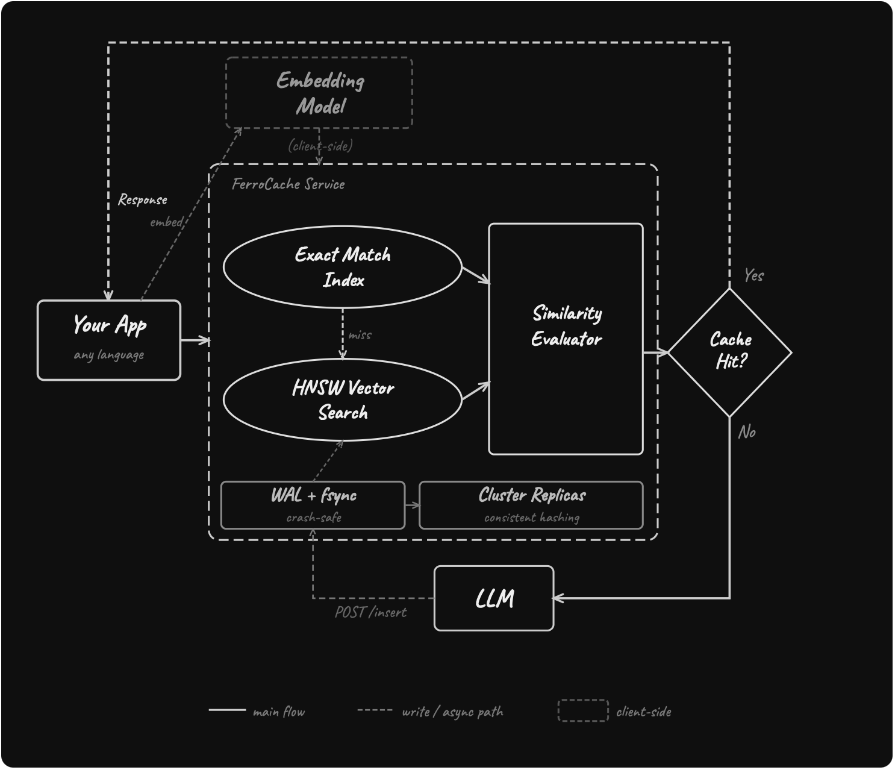

# FerroCache

**A Distributed Semantic Cache Service for LLM Applications**

FerroCache is a standalone service that sits in front of your LLM calls and returns cached responses for semantically similar queries. Because it's a compiled Rust binary with an HTTP API, **any language can use it** — Python, Go, Node.js, Java, Ruby, anything that can make an HTTP request. LLM API calls are expensive; semantically similar queries should reuse cached answers instead of paying for a new completion. Unlike GPTCache, FerroCache is a service, not an in-process library — deploy it once, share the cache across your entire fleet, and the cache survives application restarts.

## What you can do with FerroCache

- **Save money on LLM calls** — paraphrased queries return cached answers instead of paying for new completions.
- **Share a cache across your fleet** — deploy once, every app instance benefits.
- **Survive restarts** — durable WAL with fsync; snapshots compact on schedule.
- **Isolate tenants and conversations** — composable namespaces (`model_id` × `cache_scope` × `conversation_id`).
- **Run a cluster** — consistent hashing, gossip discovery, phi-accrual failure detection, read repair.

## Architecture

## Where to start

- New here? → [Quick Install](getting-started/install.md) then [Your First Cache](getting-started/first-cache.md).
- Building with Python? → [Python Client](integrations/python.md), [OpenAI wrapper](integrations/openai.md), [Anthropic wrapper](integrations/anthropic.md).
- Different language? → [HTTP API](integrations/http-api.md) — language-agnostic.
- Multi-tenant SaaS? → [Namespaces & Isolation](features/namespaces.md).
- Going to production? → [Cluster Setup](production/cluster.md), [Security](production/security.md), [Observability](production/observability.md).

## Project links

- GitHub: <https://github.com/nickleodoen/ferrocache>
- PyPI: <https://pypi.org/project/ferrocache>
- Docker: <https://ghcr.io/nickleodoen/ferrocache>
